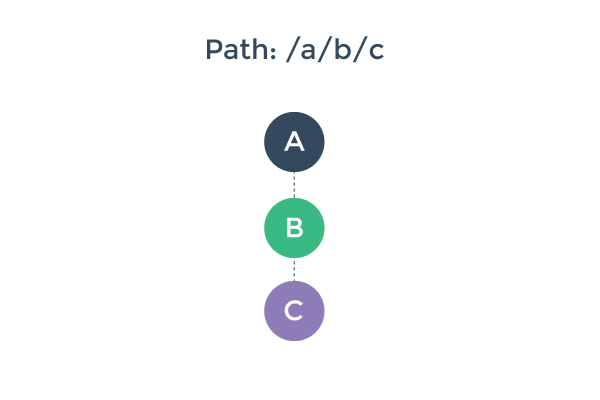

# トランジションパイプライン

route トランジションのパイプラインをよく理解するために、パス `/a/b/c` によって3つネストされて `<router-view>` で既にレンダリングされた、ルーターが使用可能なアプリケーションをイメージしてみましょう:

そして、私達のレンダリングされたコンポーネントツリーを新しいものに更新することを必要とする新しいパス `/a/d/e` にナビゲートします:

どうやって私達はそれについて行けるでしょうか？私達はここでする必要があるいくつかの事があります:

1. 潜在的にコンポーネント A を再利用することができます。なぜなら、トランジション後のコンポーネントツリーは同じであるためです。

2. 非活性化化し、そしてコンポーネント B と C を削除する必要があります。 

3. 作成し、コンポーネント D と E を活性化する必要があります。

4. ステップ2 とステップ3 を実際に実行する前に、このトランジションが有効であることを確認したい、つまり、必要に応じてこのトランジションが deactivated/activated **できる** ことを全てのコンポーネントが関与していることを確認したいです。

vue-router で、任意のトランジションフックで実装することによってこれらのステップを制御することができます。しかし、どうやってそれをするのか詳細に入る前に、大きな画像を見てみましょう。

### トランジションフェーズ

3つのフェーズで route のトランジションパイプラインを分けることができます:

1. **再利用性フェーズ (Reusability phase):**

  現状の view 階層内の全てのコンポーネントが、新しいものに再利用できるかどうかチェックします。これは2つのコンポーネントツリーを比較することによって行われます。共通のコンポーネントを見つけて、そしてそれからそれらの再利用性 (`canReuse` オプション経由) をチェックします。デフォルトでは、全てのコンポーネントは他の方法で設定しない限り再利用可能です。

  

2. **検証フェーズ (Validation phase):**

  全て現状のコンポーネントが非活性化できるかどうかチェックし、全ての新しいコンポーネントが活性化できます。これは、`canDeactivate` と `canActivate` の route 設定のフックを呼び出しとチェックで可能です。

  

  `canActivate` チェックはトップダウンですが、`canDeactivate` チェックはボトムアップなバブルであることに注意してください。

  これらの全てのフックが潜在的にトランジションを中止することができます。もしトランジションが検証フェーズの間で中止される場合は、ルーターは現状のアプリケーション状態を保存し、前のパスを復元します。

3. **活性化フェーズ (Activation phase):**

  一度全ての検証フックが呼び出され、それらのトランジションの中止がない場合、トランジションは現在有効であると言われます。ルーターは現状のコンポーネントを非活性化し、新しいコンポーネントを活性化します。

  

  これらのフックは検証フックの同じ順序で呼び出されますが、これらの目的は、目に見えるコンポーネントの切り替えが実行される前に、クリーンアップ/準備 作業をするための機会を与えるためです。インターフェイスは影響を受けるコンポーネントの `deactivate` フックと `activate` フックの全てが解決されるまで更新されません。

  `data` フックは `activate` フックが解決された直後に呼び出され、コンポーネントが再利用されるときも呼び出されます。

次の詳細では、トランジションフックについて話します。
