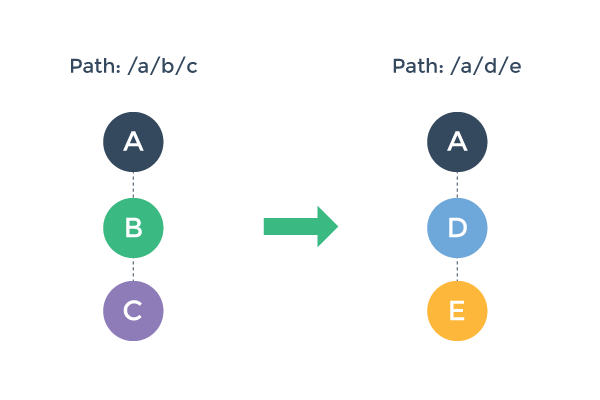
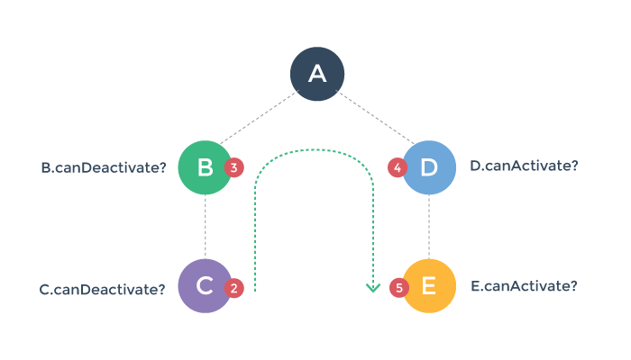

# Transition Pipeline

To better understand the pipeline of a route transition, let's imagine we have a router-enabled app, already rendered with three nested `<router-view>` with the path `/a/b/c`:

And then, the user navigates to a new path, `/a/d/e`, which requires us to update our rendered component tree to a new one:

How would we go about that? There are a few things we need to do here:

1. We can potentially reuse component A, because it remains the same in the post-transition component tree.

2. We need to deactivate and remove component B and C.

3. We need to create and activate component D and E.

4. Before we actually perform step 2 & 3, we also want to make sure this transition is valid - that is, to make sure that all components involved in this transition **can** be deactivated/activated as desired.

With vue-router, you can control these steps by implementing optional transition hooks. But before we go into details on how to do that, let's take a look at the bigger picture.

### Transition Phases

We can divide a route transition pipeline into three phases:

1. **Reusability phase:**

  Check if any component in the current view hierarchy can be reused in the new one. This is done by comparing the two component trees, find out common components, and then check their reusability (via the `canReuse` option). By default, every component is reusable unless configured otherwise.

  

2. **Validation phase:**

  Check if all current components can be deactivated, and if all new components can be activated. This is by checking and calling their `canDeactivate` and `canActivate` route config hooks.

  

  Note the `canDeactivate` check bubbles bottom-up, while the `canActivate` check is top-down.

  Any of these hooks can potentially abort the transition. If a transition is aborted during the validation phase, the router preserve current app state and restore the previous path.

3. **Activation phase:**

  Once all validation hooks have been called and none of them aborts the transition, the transition is now said to be valid. The router will now deactivate current components and activate new components.

  

  These hooks are called in the same order of the validation hooks, but their purpose is to give you the chance to do cleanup / preparation work before the visible component switching is executed. The interface will not update until all of the affected components' `deactivate` and `activate` hooks have been resolved.

  The `data` hook is called right after `activate` is resolved, and is also called when a component is reused.

We will talk about transition hooks in detail next.
